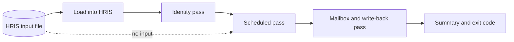
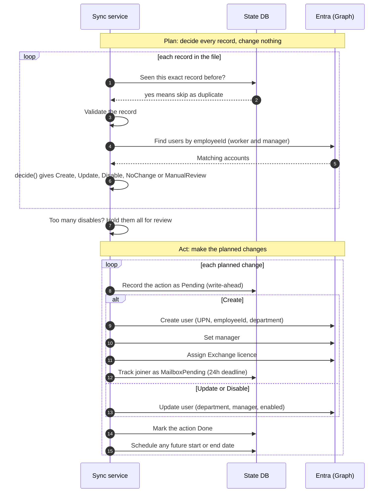
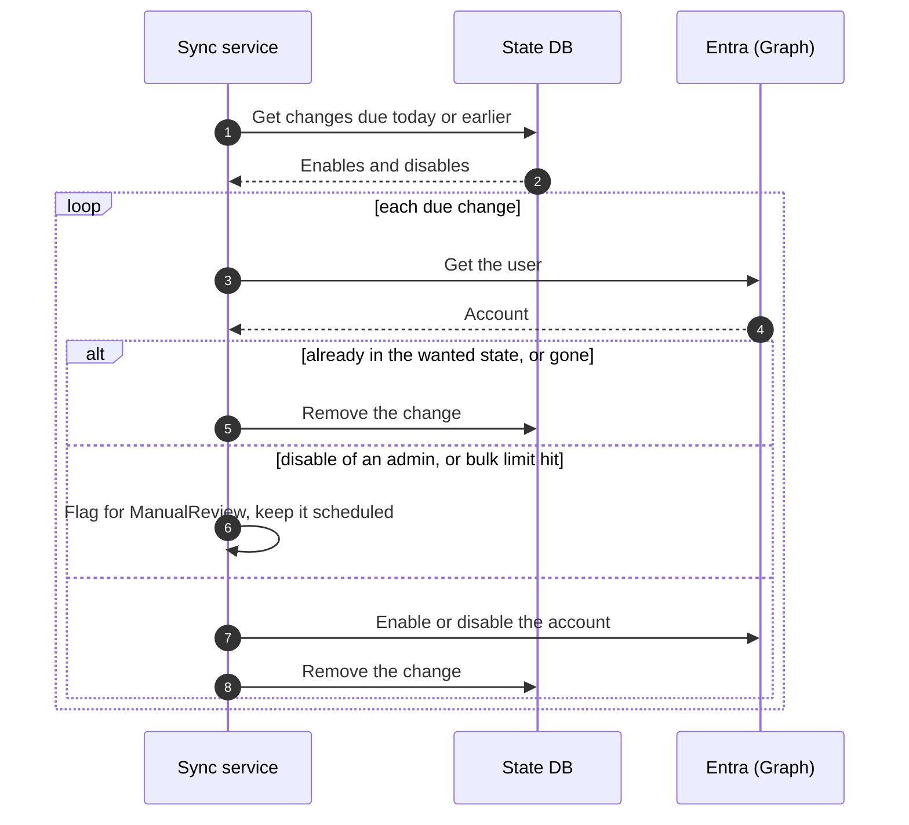
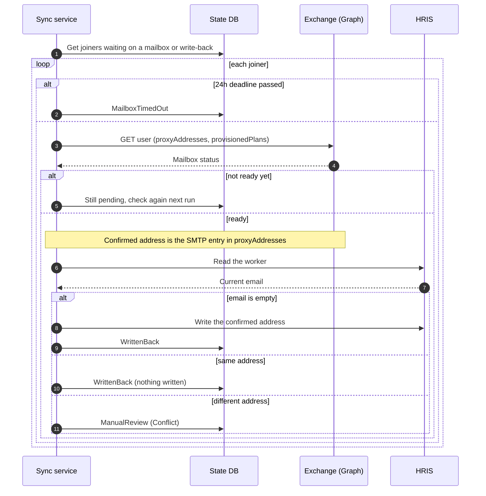

# Sequence Diagrams

## 1. One run at a glance

```mermaid
flowchart LR
    A[(HRIS input file)] --> B[Load into HRIS]
    B --> C[Identity pass]
    C --> D[Scheduled pass]
    D --> E[Mailbox and write-back pass]
    E --> F[Summary and exit code]
    A -. no input .-> D
```

## 2. Identity pass

```mermaid
sequenceDiagram
    autonumber
    participant S as Sync service
    participant DB as State DB
    participant G as Entra (Graph)

    Note over S,G: Plan: decide every record, change nothing
    loop each record in the file
        S->>DB: Seen this exact record before?
        DB-->>S: yes means skip as duplicate
        S->>S: Validate the record
        S->>G: Find users by employeeId (worker and manager)
        G-->>S: Matching accounts
        S->>S: decide() gives Create, Update, Disable, NoChange or ManualReview
    end
    S->>S: Too many disables? Hold them all for review

    Note over S,G: Act: make the planned changes
    loop each planned change
        S->>DB: Record the action as Pending (write-ahead)
        alt Create
            S->>G: Create user (UPN, employeeId, department)
            S->>G: Set manager
            S->>G: Assign Exchange licence
            S->>DB: Track joiner as MailboxPending (24h deadline)
        else Update or Disable
            S->>G: Update user (department, manager, enabled)
        end
        S->>DB: Mark the action Done
        S->>DB: Schedule any future start or end date
    end
```

## 3. Scheduled pass

```mermaid
sequenceDiagram
    autonumber
    participant S as Sync service
    participant DB as State DB
    participant G as Entra (Graph)

    S->>DB: Get changes due today or earlier
    DB-->>S: Enables and disables
    loop each due change
        S->>G: Get the user
        G-->>S: Account
        alt already in the wanted state, or gone
            S->>DB: Remove the change
        else disable of an admin, or bulk limit hit
            S->>S: Flag for ManualReview, keep it scheduled
        else
            S->>G: Enable or disable the account
            S->>DB: Remove the change
        end
    end
```

## 4. Mailbox and write-back pass

```mermaid
sequenceDiagram
    autonumber
    participant S as Sync service
    participant DB as State DB
    participant X as Exchange (Graph)
    participant H as HRIS

    S->>DB: Get joiners waiting on a mailbox or write-back
    loop each joiner
        alt 24h deadline passed
            S->>DB: MailboxTimedOut
        else
            S->>X: GET user (proxyAddresses, provisionedPlans)
            X-->>S: Mailbox status
            alt not ready yet
                S->>DB: Still pending, check again next run
            else ready
                Note over S,X: Confirmed address is the SMTP entry in proxyAddresses
                S->>H: Read the worker
                H-->>S: Current email
                alt email is empty
                    S->>H: Write the confirmed address
                    S->>DB: WrittenBack
                else same address
                    S->>DB: WrittenBack (nothing written)
                else different address
                    S->>DB: ManualReview (Conflict)
                end
            end
        end
    end
```
